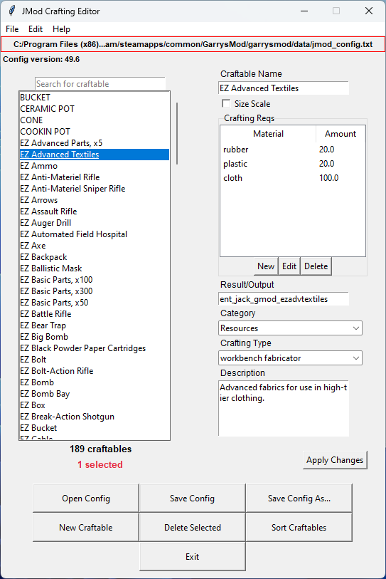

# Unofficial JMod Crafting Editor
**I AM NOT RESPONSIBLE FOR ANY DATA LOSS. USE THIS PROGRAM AT YOUR OWN RISK!**



A simple, graphical crafting editor for [JMod](https://steamcommunity.com/sharedfiles/filedetails/?id=1919689921). Made with Tkinter.

## Supported JMod Versions
- **40.0, 40.6, 42.5, 43.0, 49.6**

## Features
- Search for craftable names
- Edit craftable data
- Create and delete craftables
- Add new crafting reqs, categories, and crafting types
- Save configs to specified path

## Requirements
- [Python version 3.11 or later](https://www.python.org/downloads/)
- [Requests](https://pypi.org/project/requests/) (optional, for updates)
    ```
    pip install requests
    ```
- A JMod config file

## How to Run
1. Execute `editor.py`
2. Done

## Credits
- Jackarunda for creating JMod
- Rainbow text was inspired from [code](https://github.com/Korozin/Python-Text-Rainbow) by [@Korozin](https://github.com/Korozin)
- Some editable treeview code was derived from [@kurawlefaraaz](https://github.com/kurawlefaraaz)'s [work](https://github.com/kurawlefaraaz/Tk-Themed-Utilities)

## License
This code is released under the [GNU GPL 3.0](https://www.gnu.org/licenses/gpl-3.0.en.html) license. Feel free to make any modifications you see fit.

## Disclaimer
I am not affiliated with Jackarunda or anyone else from the JMod team. No code from JMod was used for this program.
